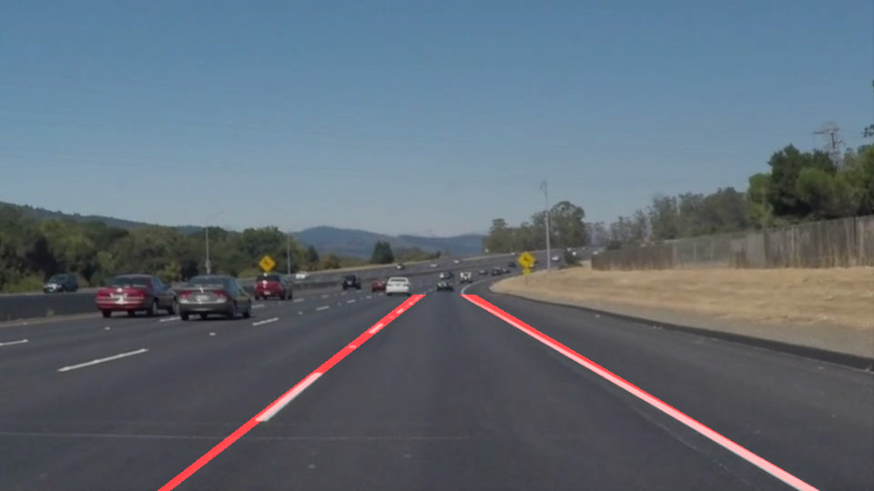

# **Finding Lane Lines on the Road** 

## Writeup for submission

---

**Finding Lane Lines on the Road**

The goals / steps of this project are the following:
* Make a pipeline that finds lane lines on the road
* Reflect on your work in a written report

[//]: # (Image References)

[image1]: ./test_images_output/solidWhiteCurve.jpg "Grayscale"

---

### Reflection

### 1. Describe your pipeline. As part of the description, explain how you modified the draw_lines() function.

My pipeline consisted of **8** steps.

**1**, I need to read all the images in the 'test_images' folder, using a 'for loop'

**2**, Within the for loop, I converted the images to grayscale, then I use the Gaussian blur to smooth the edges

**3**, Use the Canny function to extract the edges

**4**, define the vertices for mask. Here the vertices will form a polygon, and the coordinates are in ccw order

**5**, use hough function to extract all the line segments from the masked edge image, and filter out the outliers

  _here I made a change of the hough function: I disabled the two lines used to generate the line_img_

  `line_img = np.zeros((img.shape[0], img.shape[1], 3), dtype=np.uint8)`

  `draw_lines(line_img, lines)`

**6**, use slop to identify the left and right line segments. Here the trick is that, the image is flipped upside-down, so left has negative slop, and right has positive slop. Then use linear regression to get the average slop for left and right line. (This part I made mistake and later I referred to a blog (https://campushippo.com/lessons/detect-highway-lane-lines-with-opencv-and-python-21438a3e2) to make the change)

**7**, combine the extracted image size, left and right segments, and slops, to get the two extended lines. And finally apply the mask to only draw the region of interest. 
      
  _here instead of changing the_ `draw_line` _function, I used the __for__ loop to process all the lines merged from __left__ and __right__

**8**, use weighted_img to overlap the line with the original image, and output into the video

### 2. Identify potential shortcomings with your current pipeline

**1**. The parameters for Gaussian blur, canny and hough transform are all manual set and not optimized

**2**. The line information is not fully collected, e.g., the yellow line is treated the same as white line, which is not quite the same as traffic rules

**3**. Cannot distinguishi double line or single line

### 3. Suggest possible improvements to your pipeline

**1**. Instead of linear fitting, can use polynomial fitting for curved lines

**2**. Add color distinguish function/filter

**3**. Currently all the fitting are human set (rule based), can use machine learning for automatic update
